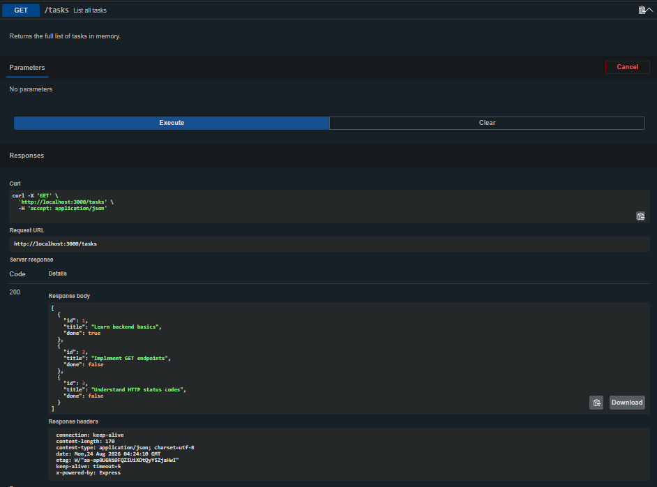
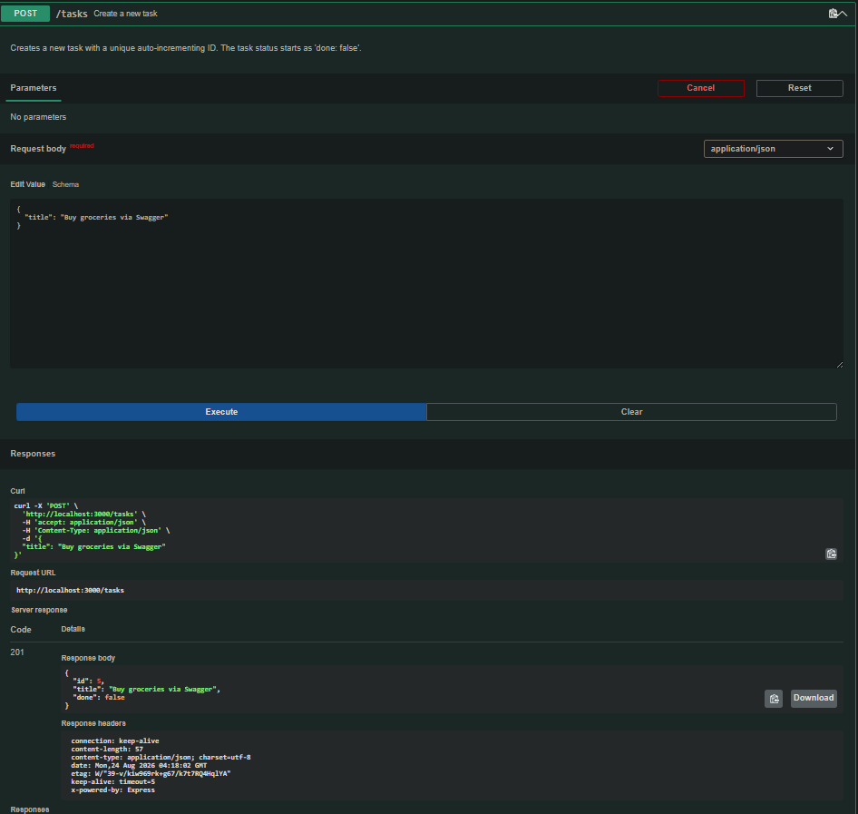
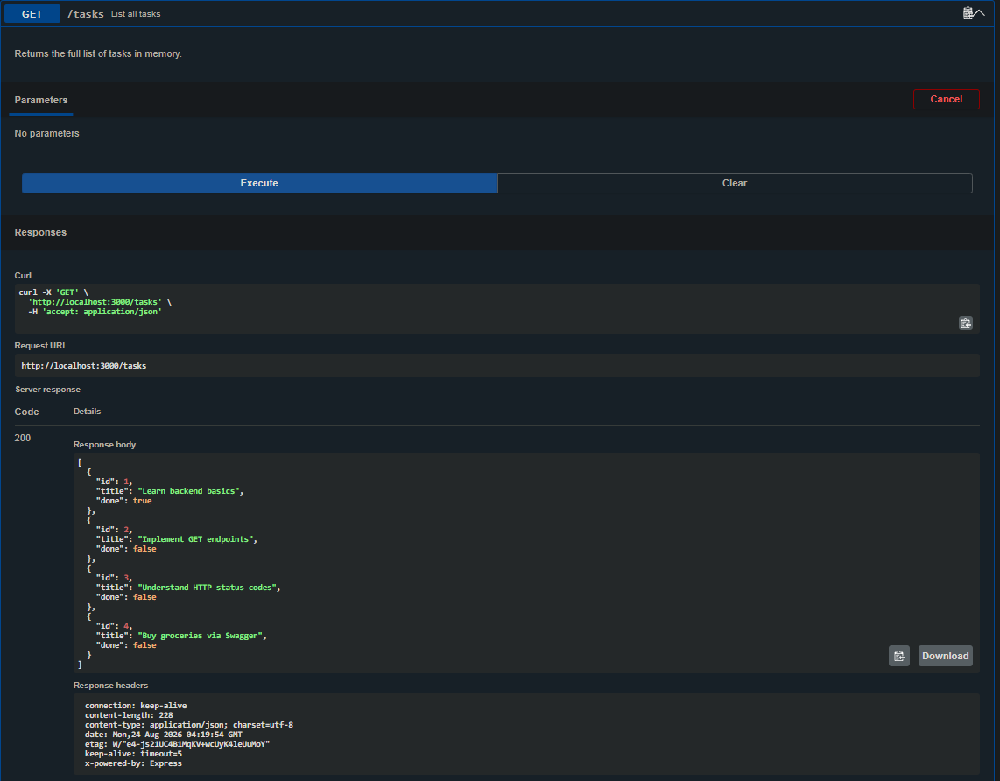
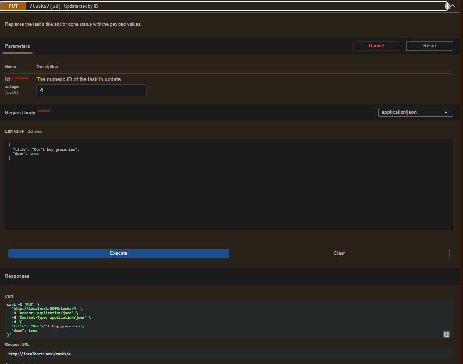
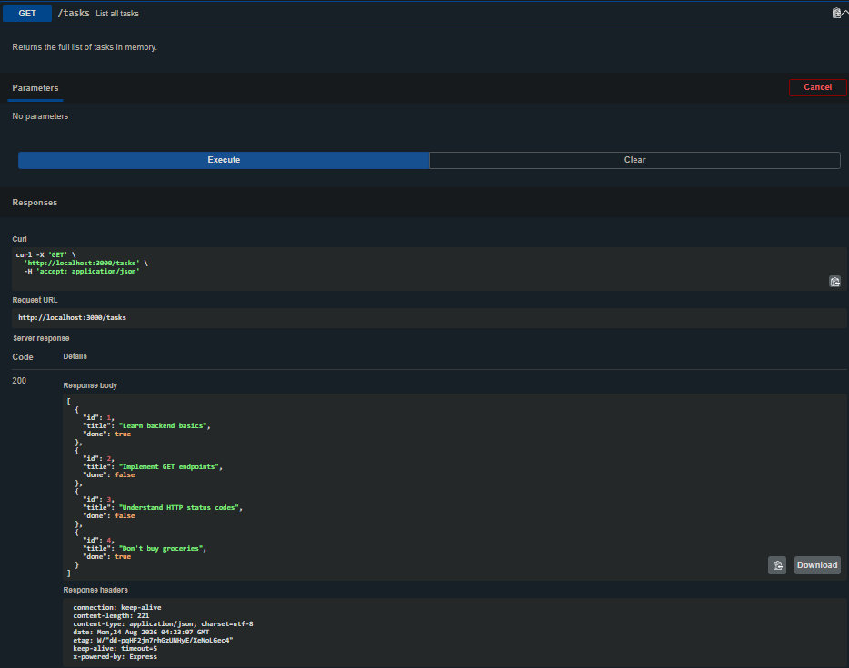
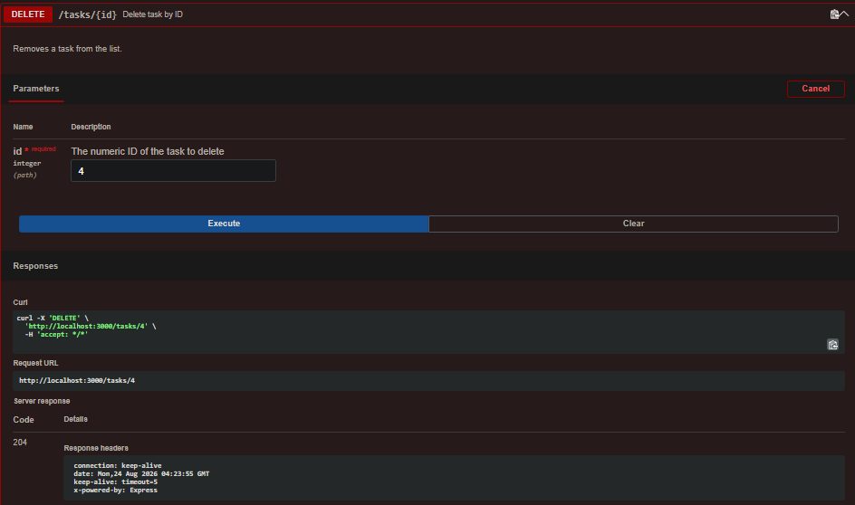
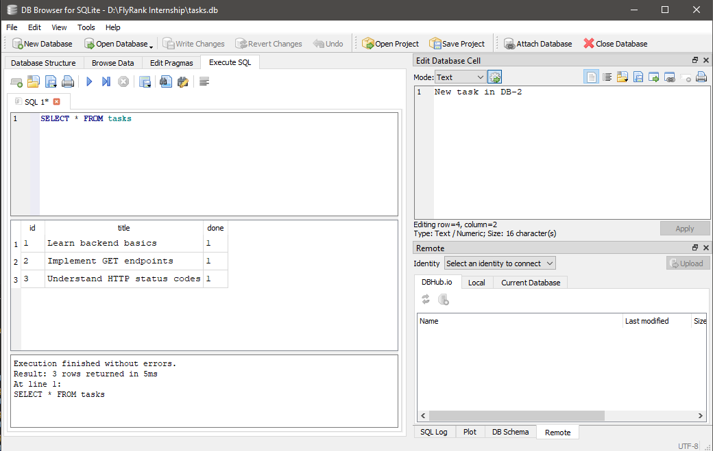

# Task API (CRUD API)

A simple, interactive, in-memory RESTful CRUD API built with Node.js and Express. This API allows managing a list of tasks with full validation, correct HTTP status codes, and built-in interactive Swagger UI documentation.

---

## 🚀 How to Install & Run

Get the server up and running locally in under a minute:

```bash
npm install && node CrudeAPI.js
```

Once started, the server will run at: **`http://localhost:3000`**  
The interactive Swagger documentation will be available at: **`http://localhost:3000/docs`**

---

## 📋 API Endpoints

| Method | Endpoint | Description | Status (Success) | Status (Failure) |
| :--- | :--- | :--- | :--- | :--- |
| **GET** | `/` | Returns API Name, Version, and list of endpoints. | `200 OK` | - |
| **GET** | `/health` | Server health check (returns `{ status: "ok" }`). | `200 OK` | - |
| **GET** | `/tasks` | Retrieves all tasks. | `200 OK` | - |
| **GET** | `/tasks/:id` | Retrieves a single task by its ID. | `200 OK` | `404 Not Found` |
| **POST** | `/tasks` | Creates a new task. Requires a JSON body. | `201 Created` | `400 Bad Request` |
| **PUT** | `/tasks/:id` | Updates an existing task's title and/or done status. | `200 OK` | `400 Bad Request`, `404 Not Found` |
| **DELETE**| `/tasks/:id` | Deletes a task by its ID. | `204 No Content` | `404 Not Found` |

---

## 🧪 Example Request/Response

### POST /tasks (Creating a new task)

```http
HTTP/1.1 201 Created
X-Powered-By: Express
Content-Type: application/json; charset=utf-8
Content-Length: 48
Date: Mon, 24 Aug 2026 04:20:00 GMT
Connection: keep-alive
Keep-Alive: timeout=5

{"id":4,"title":"Buy milk","done":false}
```

---

## 🎨 API Lifecycle Testing Screenshots

Here is the step-by-step verification of the CRUD lifecycle:

1. **GET `/tasks`** (Initial state with the 3 default tasks):
   

2. **POST `/tasks`** (Creating a 4th new task):
   

3. **GET `/tasks`** (Verifying the 4th task is now in the list):
   

4. **PUT `/tasks/4`** (Updating the 4th task):
   

5. **GET `/tasks`** (Verifying the 4th task is updated):
   

6. **DELETE `/tasks/4`** (Deleting the 4th task):
   

7. **GET `/tasks`** (Verifying task is deleted and we are back to the original 3 tasks):
   

---

## 🗄️ Database Integration (Week 3)

This project has been upgraded to persist data using a real SQLite database.

### Why SQLite was chosen:
1. **Zero Configuration**: SQLite requires no external server setup, no usernames, and no passwords. It runs completely self-contained.
2. **Single-File Storage**: The entire database is stored as a single file (`tasks.db`) on your disk, making it extremely lightweight and portable.
3. **Automatic Creation**: If the database file is missing on startup, Node.js automatically creates the file, structures the tables, and seeds the initial data.

### Where the database is stored:
The database file lives in the root directory as **`tasks.db`**. It is included in `.gitignore` so that every new developer starts with a fresh database setup.

### Example SQL query executed:
To filter and view only completed tasks, we can run this query inside our SQLite database:
```sql
SELECT * FROM tasks WHERE done = 1;
```

### Database Viewer Screenshot:
Below is a screenshot showing the database open inside the **DB Browser for SQLite** viewer:




